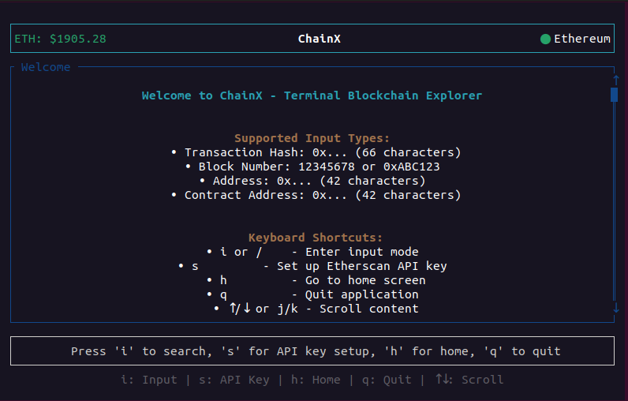
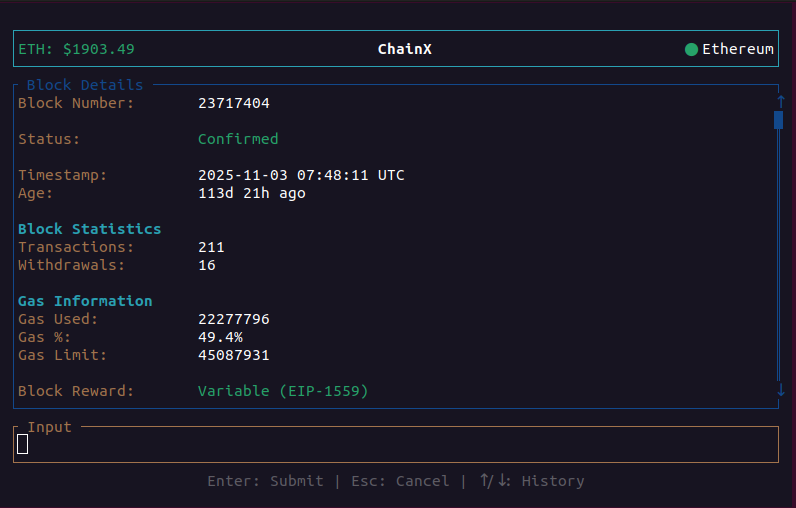
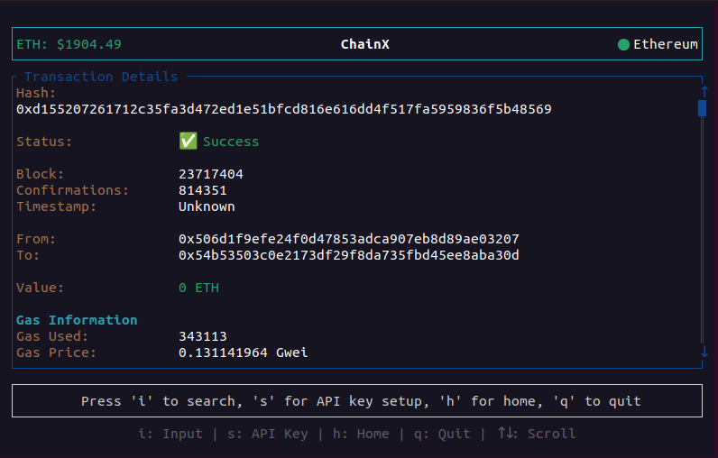
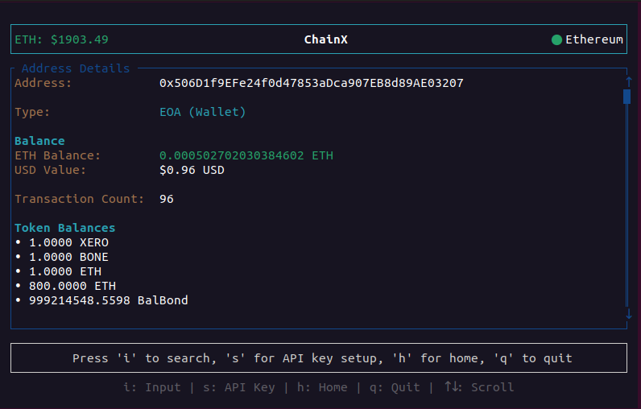
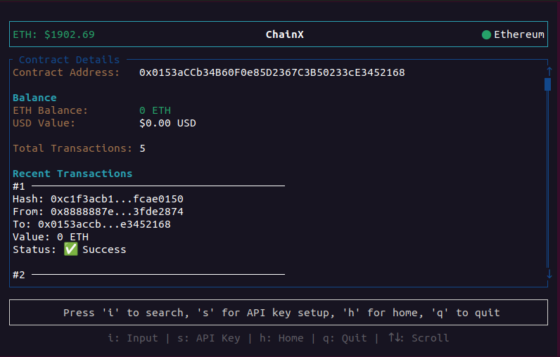
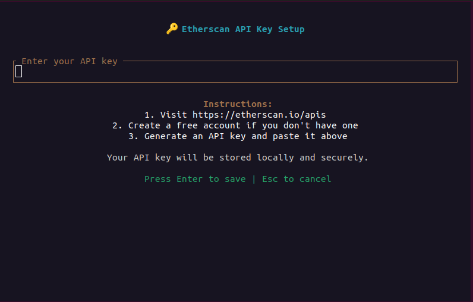

<div align="center">

<pre>
       ██████╗██╗  ██╗ █████╗ ██╗███╗   ██╗██╗  ██╗
      ██╔════╝██║  ██║██╔══██╗██║████╗  ██║╚██╗██╔╝
      ██║     ███████║███████║██║██╔██╗ ██║ ╚███╔╝ 
      ██║     ██╔══██║██╔══██║██║██║╚██╗██║ ██╔██╗ 
      ╚██████╗██║  ██║██║  ██║██║██║ ╚████║██╔╝ ██╗
      ╚═════╝╚═╝  ╚═╝╚═╝  ╚═╝╚═╝╚═╝  ╚═══╝╚═╝  ╚═╝
</pre>

<h3>⚡ Terminal-Powered Blockchain Intelligence ⚡</h3>

<p align="center">
  
  
  
  
  
</p>

---

<p align="center">
  <strong>🔮 See The Chain. Control The Data. Own The Terminal. 🔮</strong>
</p>

<p align="center">
  <em>The blockchain explorer that doesn't slow you down.</em>
</p>

</div>

---

## 🎬 Visual Showcase

<p align="center">
  
  <br/><sub><b>🏠 Home Screen</b> — Your command center for blockchain exploration</sub>
</p>

<br/>

<table>
<tr>
<td width="50%">

<p align="center">
  
  <br/><sub><b>📦 Block Explorer</b> — Deep dive into blocks & gas metrics</sub>
</p>

</td>
<td width="50%">

<p align="center">
  
  <br/><sub><b>💳 Transactions</b> — Complete tx analysis in seconds</sub>
</p>

</td>
</tr>
<tr>
<td width="50%">

<p align="center">
  
  <br/><sub><b>👛 Wallets</b> — Balances, tokens & history</sub>
</p>

</td>
<td width="50%">

<p align="center">
  
  <br/><sub><b>📜 Contracts</b> — Smart contract intelligence</sub>
</p>

</td>
</tr>
</table>

<p align="center">
  
  <br/><sub><b>🔐 Secure API Setup</b> — One-time configuration, lifetime access</sub>
</p>

---

## ⚡ Why ChainX?

<pre align="center">
┌─────────────────────────────────────────────────────────┐
│  "Why open a browser when your terminal is already open?" │
└─────────────────────────────────────────────────────────┘
</pre>

**ChainX** eliminates context switching. No browser tabs. No slow web interfaces. Just pure, terminal-native blockchain exploration with **sub-second response times** and **zero bloat**.

---

## 🚀 Features That Hit Different

<table>
<tr>
<td width="50%">

### 🎨 **Terminal-Native UI**
- Powered by **ratatui** for buttery-smooth rendering
- Zero-latency keyboard navigation
- Auto-adapts to any terminal size
- Dark mode by default (it's the only mode)

</td>
<td width="50%">

### ⚡ **Blazing Fast**
- **Rust** + **Tokio** = unmatched performance
- Async I/O throughout
- Intelligent price caching
- Minimal API calls, maximum data

</td>
</tr>
<tr>
<td width="50%">

### 💰 **Live Market Data**
- Real-time ETH/USD price (10s updates)
- Auto-calculated USD values
- Cached for instant display
- No refresh needed

</td>
<td width="50%">

### 🛡️ **Security Hardened**
- Scam token filtering
- Secure API key storage
- Address validation
- Zero sensitive logging

</td>
</tr>
<tr>
<td width="50%">

### ⌨️ **Vim Motions**
- `j/k` to scroll
- `gg` / `G` navigation
- `i` to input, `Esc` to exit
- Zero mouse required

</td>
<td width="50%">

### 🔍 **Auto-Detect Magic**
- Paste any: hash, address, or block
- No mode switching
- Instant recognition
- One key to query them all

</td>
</tr>
</table>

---

## 🎯 Quick Start

```bash
# ⚡ Install in 30 seconds
git clone https://github.com/ZaifMirza/ChainX.git
cd chainx && cargo build --release

# 🚀 Launch
cargo run --release

# 🎮 Start exploring
# Press 'i' → Paste any blockchain data → Hit Enter
```

---

## ⌨️ Command Reference

<pre>
┌────────────────────────────────────────────────────────┐
│                    CHAINX CONTROLS                      │
├────────────────────────────────────────────────────────┤
│  i or /      →  Enter query mode                       │
│  Enter       →  Submit query                           │
│  Esc         →  Cancel / Exit                          │
│  h           →  Home screen                            │
│  q           →  Quit                                   │
│  ↑ ↓ or j k  →  Scroll                                 │
│  PgUp/PgDn   →  Fast scroll                            │
│  Home/End    →  Jump top/bottom                        │
│  s           →  Setup API key                          │
└────────────────────────────────────────────────────────┘
</pre>

### Input Types (Auto-Detected)

| What You Paste | Type | Example |
|:--|:--:|--|
| `0x...66 chars` | 🔗 Transaction | `0xabc123...` |
| `0x...42 chars` | 👛 Address | `0x742d35...` |
| `12345678` | 📦 Block Number | `18547293` |

---

## 🌐 Multi-Chain Ready

| Chain | ID | Status |
|:--|:-:|:--:|
| Ethereum | 1 | ✅ Live |
| Polygon | 137 | ✅ Live |
| BSC | 56 | ✅ Live |
| Arbitrum | 42161 | ✅ Live |
| Optimism | 10 | ✅ Live |
| Base | 8453 | ✅ Live |
| Avalanche | 43114 | ✅ Live |
| Sepolia | 11155111 | ✅ Testnet |

---

## 🛠️ Stack

<p align="center">
  
  
  
  
  
  
</p>

---

## ⚙️ Setup

### 1. Get Your API Key (Free)

```
🔐 Etherscan.io → Login → API Keys → Create
```

### 2. Configure

```bash
# Create .env file
echo "ETHERSCAN_API_KEY=your_key_here" > .env

# Or set in-app (press 's')
```

> 💡 **Free tier: 5 calls/sec — more than enough for power users**

---

## 🤝 Contribute

```bash
# 🍴 Fork it
git clone https://github.com/ZaifMirza/ChainX.git

# 🌿 Branch it
git checkout -b feature/your-feature

# 💾 Commit it
git commit -m "feat: add something amazing"

# 🚀 Push it
git push origin feature/your-feature

# 🔥 PR it
```

---

## 📜 License

```
MIT License — Do whatever you want. Just don't blame us.
```

---

<div align="center">

<pre>
┌─────────────────────────────────────────────────────────┐
│          Built with ⚡ by developers, for developers     │
│                    Ethereum Community ❤️                  │
└─────────────────────────────────────────────────────────┘
</pre>

**[⭐ Star Us](https://github.com/ZaifMirza/ChainX)** • **[🐛 Report Bug](https://github.com/ZaifMirza/ChainX/issues)** • **[💬 Discuss](https://github.com/ZaifMirza/ChainX/discussions)**

<p align="center">
  
  
</p>

</div>
